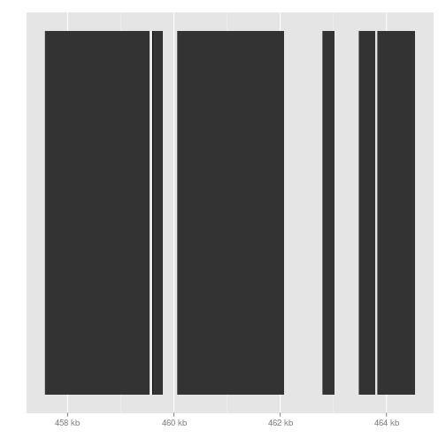
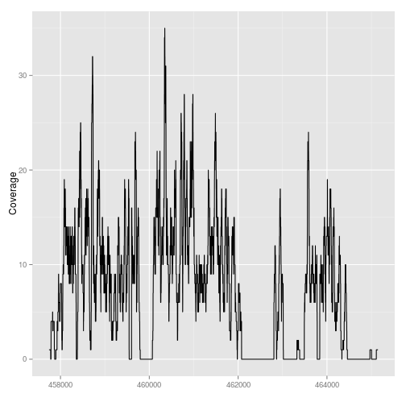

# Visualizing NGS data

## Introduction


We will use the following libraries to demonstrate visualization of NGS data.


```r
source("http://bioconductor.org/biocLite.R")
```

```
## Bioconductor version 2.14 (BiocInstaller 1.14.2), ?biocLite for
##   help
```

```r
installifnot <- function (packageName){
  if (!(require(packageName, character.only=TRUE))) biocLite(packageName)
}
installifnot("pasillaBamSubset")
```

```
## Loading required package: pasillaBamSubset
```

```r
installifnot("TxDb.Dmelanogaster.UCSC.dm3.ensGene")
```

```
## Loading required package: TxDb.Dmelanogaster.UCSC.dm3.ensGene
## Loading required package: GenomicFeatures
## Loading required package: BiocGenerics
## Loading required package: parallel
## 
## Attaching package: 'BiocGenerics'
## 
## The following objects are masked from 'package:parallel':
## 
##     clusterApply, clusterApplyLB, clusterCall, clusterEvalQ,
##     clusterExport, clusterMap, parApply, parCapply, parLapply,
##     parLapplyLB, parRapply, parSapply, parSapplyLB
## 
## The following object is masked from 'package:stats':
## 
##     xtabs
## 
## The following objects are masked from 'package:base':
## 
##     anyDuplicated, append, as.data.frame, as.vector, cbind,
##     colnames, do.call, duplicated, eval, evalq, Filter, Find, get,
##     intersect, is.unsorted, lapply, Map, mapply, match, mget,
##     order, paste, pmax, pmax.int, pmin, pmin.int, Position, rank,
##     rbind, Reduce, rep.int, rownames, sapply, setdiff, sort,
##     table, tapply, union, unique, unlist
## 
## Loading required package: IRanges
## Loading required package: GenomicRanges
## Loading required package: GenomeInfoDb
## Loading required package: AnnotationDbi
## Loading required package: Biobase
## Welcome to Bioconductor
## 
##     Vignettes contain introductory material; view with
##     'browseVignettes()'. To cite Bioconductor, see
##     'citation("Biobase")', and for packages 'citation("pkgname")'.
```

```r
installifnot("Rsamtools")
```

```
## Loading required package: Rsamtools
## Loading required package: XVector
## Loading required package: Biostrings
```

```r
installifnot("GenomicRanges")
installifnot("GenomicAlignments")
```

```
## Loading required package: GenomicAlignments
## Loading required package: BSgenome
## 
## Attaching package: 'BSgenome'
## 
## The following object is masked from 'package:AnnotationDbi':
## 
##     species
```

```r
installifnot("biomaRt")
```

```
## Loading required package: biomaRt
```

```r
installifnot("GenomicFeatures")
installifnot("Gviz")
```

```
## Loading required package: Gviz
## Loading required package: grid
```

```r
installifnot("ggbio")
```

```
## Loading required package: ggbio
## Loading required package: ggplot2
## Need specific help about ggbio? try mailing 
##  the maintainer or visit http://tengfei.github.com/ggbio/
## 
## Attaching package: 'ggbio'
## 
## The following objects are masked from 'package:ggplot2':
## 
##     geom_bar, geom_rect, geom_segment, ggsave, stat_bin,
##     stat_identity, xlim
```

The `pasillaBamSubset` contains utility functions to return the paths to 2 BAM files :`untreated1_chr4.bam` and `untreated3_chr4.bam`.


```r
require (pasillaBamSubset)
fl1 <- untreated1_chr4()
fl2 <- untreated3_chr4()
```

We will try four ways to look at NGS coverage: using the standalone Java program IGV, using simple `plot` commands, and using the `Gviz` and `ggbio` packages in Bioconductor.

## IGV

IGV is a Java program which can be run using Java Web Start, or from the command line.


Copy these files from the R library directory to the current working directory. First set the working directory to the source file location. We need to use the `Rsamtools` library to index the BAM files for using IGV.


```r
file.copy(from=fl1,to=basename(fl1))
```

```
## [1] FALSE
```

```r
file.copy(from=fl2,to=basename(fl2))
```

```
## [1] FALSE
```

```r
require(Rsamtools)
indexBam(basename(fl1))
```

```
##       untreated1_chr4.bam 
## "untreated1_chr4.bam.bai"
```

```r
indexBam(basename(fl2))
```

```
##       untreated3_chr4.bam 
## "untreated3_chr4.bam.bai"
```

IGV is freely available for download here: https://www.broadinstitute.org/igv/home

You will need to provide an email, and then you will get a download link.

As an example you will use IGV to look for gene *lgs* and examine the reads.

You will find detailed instructions on how to proceed in the document "lab1-visualizing_NGS.pdf"


Note that if you have trouble downloading IGV, another option for visualization is the UCSC Genome Browser: http://genome.ucsc.edu/cgi-bin/hgTracks 

The UCSC Genome Browser is a great resource, having many tracks involving gene annotations, conservation over multiple species, and the ENCODE epigentic tracks already available. However, the UCSC Genome Browser requires that you upload your genomic files to their server, or put your data on a publicly available server. This is not always possible if you are working with confidential data.

## Simple plot

Next we will look at the same gene using the simple `plot` function in R.


```r
require(GenomicRanges)
```

Note: if you are using Bioconductor version 14, paired with R 3.1, you should also load this library. You do not need to load this library, and it will not be available to you, if you are using Bioconductor version 13, paired with R 3.0.x.


```r
require(GenomicAlignments)
```

We read in the alignments from the file `fl1`. Then we use the `coverage` function to tally up the basepair coverage. 
We then extract the subset of coverage which overlaps our gene of interest, and convert this coverage from an `RleList` into a `numeric` vector. 

`Rle` objects are compressed, such that repeating numbers are stored as a number and a length.


```r
x <- readGAlignments(fl1)
xcov <- coverage(x)
z <- GRanges("chr4",IRanges(456500,466000))
# Bioconductor 2.14
xcov[z]
```

```
## RleList of length 1
## $chr4
## integer-Rle of length 9501 with 1775 runs
##   Lengths: 1252   10   52    4    7    2 ...   10    7   12  392   75 1041
##   Values :    0    2    3    4    5    6 ...    3    2    1    0    1    0
```

```r
# Bioconductor 2.13
xcov$chr4[ranges(z)]
```

```
## integer-Rle of length 9501 with 1775 runs
##   Lengths: 1252   10   52    4    7    2 ...   10    7   12  392   75 1041
##   Values :    0    2    3    4    5    6 ...    3    2    1    0    1    0
```

```r
xnum <- as.numeric(xcov$chr4[ranges(z)])
plot(xnum)
```

 

We can do the same for another file and plot them together.


```r
y <- readGAlignmentPairs(fl2)
ycov <- coverage(y)
ynum <- as.numeric(ycov$chr4[ranges(z)])
plot(xnum, type="l", col="blue", lwd=2)
lines(ynum, col="red", lwd=2)
```

 

We can zoom in on a single exon:


```r
plot(xnum, type="l", col="blue", lwd=2, xlim=c(6200,6600))
lines(ynum, col="red", lwd=2)
```

 

## Extracting the gene of interest using the transcript database

Suppose we are interested in visualizing the gene *lgs*. 
We can extract it from the transcript database `TxDb.Dmelanogaster.UCSC.dm3.ensGene` on Bioconductor, but first we need to look up the Ensembl gene name. 
This can be done using the `biomaRt` package which provides similar functionalities to `Biomart` the software used to extract information from genome databases.


```r
require(biomaRt)
m <- useMart("ensembl", dataset = "dmelanogaster_gene_ensembl")
lf <- listFilters(m)
lf[grep("name", lf$description, ignore.case=TRUE),]
```

```
##                             name
## 1                chromosome_name
## 12  with_flybasename_translation
## 15   with_flybasename_transcript
## 19         with_flybasename_gene
## 62              flybasename_gene
## 63        flybasename_transcript
## 64       flybasename_translation
## 86                 wikigene_name
## 98                go_parent_name
## 194               so_parent_name
##                                      description
## 1                                Chromosome name
## 12                with FlyBaseName protein ID(s)
## 15             with FlyBaseName transcript ID(s)
## 19                   with FlyBaseName gene ID(s)
## 62           FlyBaseName Gene ID(s) [e.g. cul-2]
## 63  FlyBaseName Transcript ID(s) [e.g. cul-2-RB]
## 64     FlyBaseName Protein ID(s) [e.g. cul-2-PB]
## 86                 WikiGene Name(s) [e.g. Ir21a]
## 98                              Parent term name
## 194                             Parent term name
```

```r
map <- getBM(mart = m,
  attributes = c("ensembl_gene_id", "flybasename_gene"),
  filters = "flybasename_gene", 
  values = "lgs")
map
```

```
##   ensembl_gene_id flybasename_gene
## 1     FBgn0039907              lgs
```

Now we may wish to extract the exons for each gene, and then the exons for the gene *lgs*. To do this we need the `exonsBy` function from the `GenomicFeatures` package.


```r
require(GenomicFeatures)
require(TxDb.Dmelanogaster.UCSC.dm3.ensGene)
grl <- exonsBy(TxDb.Dmelanogaster.UCSC.dm3.ensGene, by="gene")
gene <- grl[[map$ensembl_gene_id[1]]]
gene
```

```
## GRanges with 6 ranges and 2 metadata columns:
##       seqnames           ranges strand |   exon_id   exon_name
##          <Rle>        <IRanges>  <Rle> | <integer> <character>
##   [1]     chr4 [457583, 459544]      - |     63350        <NA>
##   [2]     chr4 [459601, 459791]      - |     63351        <NA>
##   [3]     chr4 [460074, 462077]      - |     63352        <NA>
##   [4]     chr4 [462806, 463015]      - |     63353        <NA>
##   [5]     chr4 [463490, 463780]      - |     63354        <NA>
##   [6]     chr4 [463839, 464533]      - |     63355        <NA>
##   ---
##   seqlengths:
##        chr2L     chr2R     chr3L ...   chrXHet   chrYHet chrUextra
##     23011544  21146708  24543557 ...    204112    347038  29004656
```

Finally we can plot these ranges to see what it looks like:


```r
rg <- range(gene)
plot(c(start(rg), end(rg)), c(0,0), type="n", xlab=seqnames(gene)[1], ylab="")
arrows(start(gene),rep(0,length(gene)),
       end(gene),rep(0,length(gene)),
       lwd=3, length=.1)
```

 

But actually, the gene is on the minus strand. We should add a line which corrects for minus strand genes:


```r
plot(c(start(rg), end(rg)), c(0,0), type="n", xlab=seqnames(gene)[1], ylab="")
arrows(start(gene),rep(0,length(gene)),
       end(gene),rep(0,length(gene)),
       lwd=3, length=.1, 
       code=ifelse(as.character(strand(gene)[1]) == "+", 2, 1))
```

 

## Gviz

We will briefly show two packages for visualizing genomic data in Bioconductor. Note that each of these have extensive vignettes for plotting many kinds of data. We will show here how to make the coverage plots as before:


```r
require(Gviz)
gtrack <- GenomeAxisTrack()
atrack <- AnnotationTrack(gene, name = "Gene Model")
plotTracks(list(gtrack, atrack))
```

 

Extract the coverage. `Gviz` expects that data will be provided as `GRanges` objects, so we convert the `RleList` coverage to a `GRanges` object:


```r
xgr <- as(xcov, "GRanges")
ygr <- as(ycov, "GRanges")
dtrack1 <- DataTrack(xgr[xgr %over% z], name = "sample 1")
dtrack2 <- DataTrack(ygr[ygr %over% z], name = "sample 2")
plotTracks(list(gtrack, atrack, dtrack1, dtrack2))
```

 

```r
plotTracks(list(gtrack, atrack, dtrack1, dtrack2), type="polygon")
```

 

## ggbio


```r
require (ggbio)
autoplot(gene)
```

 

```r
autoplot(fl1, which=z)
```

```
## reading in as Bamfile
## Parsing raw coverage...
## Read GAlignments from BamFile...
## extracting information...
```

 

```r
autoplot(fl2, which=z)
```

```
## reading in as Bamfile
## Parsing raw coverage...
## Read GAlignments from BamFile...
## extracting information...
```

 

## Footnotes

- IGV 
<https://www.broadinstitute.org/igv/home>

- Gviz
<http://www.bioconductor.org/packages/release/bioc/html/Gviz.html>

- ggbio
<http://www.bioconductor.org/packages/release/bioc/html/ggbio.html>

- UCSC Genome Browser: zooms and scrolls over chromosomes, showing the work of annotators worldwide
<http://genome.ucsc.edu/>

- Ensembl genome browser: genome databases for vertebrates and other eukaryotic species
<http://ensembl.org>

- Roadmap Epigenome browser: public resource of human epigenomic data
<http://www.epigenomebrowser.org>
<http://genomebrowser.wustl.edu/>
<http://epigenomegateway.wustl.edu/>

- "Sashimi plots" for RNA-Seq
<http://genes.mit.edu/burgelab/miso/docs/sashimi.html>

- Circos: designed for visualizing genomic data in a cirlce
<http://circos.ca/>

- SeqMonk: a tool to visualise and analyse high throughput mapped sequence data
<http://www.bioinformatics.babraham.ac.uk/projects/seqmonk/>

