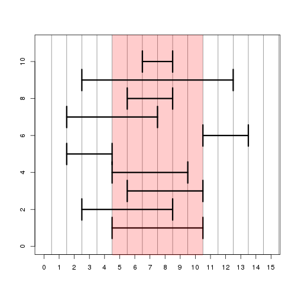

# Basic Bioconductor infrastructure


```r
source("http://bioconductor.org/biocLite.R")
```

```
## Bioconductor version 2.14 (BiocInstaller 1.14.2), ?biocLite for
##   help
```

```r
installifnot <- function (packageName){
  if (!(require(packageName, character.only=TRUE))) biocLite(packageName)
}
installifnot("IRanges")
```

```
## Loading required package: IRanges
## Loading required package: BiocGenerics
## Loading required package: parallel
## 
## Attaching package: 'BiocGenerics'
## 
## The following objects are masked from 'package:parallel':
## 
##     clusterApply, clusterApplyLB, clusterCall, clusterEvalQ,
##     clusterExport, clusterMap, parApply, parCapply, parLapply,
##     parLapplyLB, parRapply, parSapply, parSapplyLB
## 
## The following object is masked from 'package:stats':
## 
##     xtabs
## 
## The following objects are masked from 'package:base':
## 
##     anyDuplicated, append, as.data.frame, as.vector, cbind,
##     colnames, do.call, duplicated, eval, evalq, Filter, Find, get,
##     intersect, is.unsorted, lapply, Map, mapply, match, mget,
##     order, paste, pmax, pmax.int, pmin, pmin.int, Position, rank,
##     rbind, Reduce, rep.int, rownames, sapply, setdiff, sort,
##     table, tapply, union, unique, unlist
```

```r
installifnot("GenomicRanges")
```

```
## Loading required package: GenomicRanges
## Loading required package: GenomeInfoDb
```

```r
installifnot("GenomicAlignments")
```

```
## Loading required package: GenomicAlignments
## Loading required package: Biostrings
## Loading required package: XVector
## Loading required package: Rsamtools
## Loading required package: BSgenome
```

```r
installifnot("parathyroidSE")
```

```
## Loading required package: parathyroidSE
```

```r
installifnot("GenomicFeatures")
```

```
## Loading required package: GenomicFeatures
## Loading required package: AnnotationDbi
## Loading required package: Biobase
## Welcome to Bioconductor
## 
##     Vignettes contain introductory material; view with
##     'browseVignettes()'. To cite Bioconductor, see
##     'citation("Biobase")', and for packages 'citation("pkgname")'.
## 
## 
## Attaching package: 'AnnotationDbi'
## 
## The following object is masked from 'package:BSgenome':
## 
##     species
```

## IRanges

IRanges is a library for representing ranges
of integers, which is useful in genomics, because we have base pair
ranges that we'd like to manipulate.
There's a very detailed vignette, which you can access,
which contains a lot of detailed information about all
the different classes and functions which are contained in the IRanges
Package.

This lab shows a summary of the most important functions.
IRanges have a start an end, and a width.
If you just specify two numbers, you specify the start and the end.


```r
library(IRanges)
ir <- IRanges(5,10)
ir
```

```
## IRanges of length 1
##     start end width
## [1]     5  10     6
```

```r
start(ir)
```

```
## [1] 5
```

```r
end(ir)
```

```
## [1] 10
```

```r
width(ir)
```

```
## [1] 6
```

```r
# ?IRanges
```

Here we have an IRange which starts at 5, ends at 10,
and it's there for six base pairs long.
You can see that the first three
arguments are start, end, and width.
And if you specify the start is 5, and the width should be 6,
you'll get the identical IRange.


```r
ir <- IRanges(start=c(3,5,17), end=c(10,8,20))
ir
```

```
## IRanges of length 3
##     start end width
## [1]     3  10     8
## [2]     5   8     4
## [3]    17  20     4
```

```r
ir <- IRanges(5,10)
```

There are a number of intra range methods for IRanges.
And intra range means that the operation will occur for each range
that you have, and it doesn't depend on the other ranges that
are contained in IRanges object.

An example of this is to shift the I Range to the left by two.
Before we had an I Range that started at 5 and ended at 10,
and applying the shift operation produces an I Range which starts at 3
and ends at 8.

```r
# ?"intra-range-methods"
shift(ir, -2)
```

```
## IRanges of length 1
##     start end width
## [1]     3   8     6
```

Remeber, all of these commands can work on more than one range at once. Here we show the effects of the different methods using a single range:

In addition to the shift function, we also have a number of other functions,
including `narrow`. THis function works relative to the start, you should instead
start this range at the second base pair.
So relative to 5, it should start at 6.
You can also say, relative to 5, you should
end on the fifth base pair, which means it should end at 9.

The `flank` function allows you to get flanking sequence
here three base pairs from the start.
You can also get three base pairs from the end
by specifying start equals false.
And you can say you want a bidirectional flanking sequence
from the start by specifying both equals true.


```r
ir
```

```
## IRanges of length 1
##     start end width
## [1]     5  10     6
```

```r
shift(ir,-2)
```

```
## IRanges of length 1
##     start end width
## [1]     3   8     6
```

```r
narrow(ir, start=2)
```

```
## IRanges of length 1
##     start end width
## [1]     6  10     5
```

```r
narrow(ir, end=5)
```

```
## IRanges of length 1
##     start end width
## [1]     5   9     5
```

```r
flank(ir, width=3, start=TRUE, both=FALSE)
```

```
## IRanges of length 1
##     start end width
## [1]     2   4     3
```

```r
flank(ir, width=3, start=FALSE, both=FALSE)
```

```
## IRanges of length 1
##     start end width
## [1]    11  13     3
```

```r
flank(ir, width=3, start=TRUE, both=TRUE)
```

```
## IRanges of length 1
##     start end width
## [1]     2   7     6
```

```r
ir * 2
```

```
## IRanges of length 1
##     start end width
## [1]     6   8     3
```

```r
ir + 2
```

```
## IRanges of length 1
##     start end width
## [1]     3  12    10
```

```r
ir - 2
```

```
## IRanges of length 1
##     start end width
## [1]     7   8     2
```

The previous functions and operations can be easily visualized simply using the `plot` function.


```r
# set up a plotting window so we can look at range operations
plotir <- function(ir,i) { arrows(start(ir)-.5,i,end(ir)+.5,i,code=3,angle=90,lwd=3) }
plot(0,0,xlim=c(0,15),ylim=c(0,11),type="n",xlab="",ylab="",xaxt="n")
axis(1,0:15)
abline(v=0:30 + .5,col=rgb(0,0,0,.5))

# plot the original IRange
plotir(ir,1)

# draw a red shadow for the original IRange
polygon(c(start(ir)-.5,start(ir)-.5,end(ir)+.5,end(ir)+.5),c(-1,12,12,-1),col=rgb(1,0,0,.2),border=NA)
plotir(shift(ir,-2), 2)
plotir(narrow(ir, start=2), 3)
plotir(narrow(ir, end=5), 4)
plotir(flank(ir, width=3, start=TRUE, both=FALSE), 5)
plotir(flank(ir, width=3, start=FALSE, both=FALSE), 6)
plotir(flank(ir, width=3, start=TRUE, both=TRUE), 7)
plotir(ir * 2, 8)
plotir(ir + 2, 9)
plotir(ir - 2, 10)
```

 

The inter range methods are those functions which depend on the other ranges in the object.
We can create an IRanges object with three ranges, which
starts at 3, 5, 17, ends at 10, 8, and 20. 
If you ask for the range, this will give you the beginning of the IRanges
to the end, including gaps in between.
So this gives us the start of 3 and the end of 20.

If we say `reduce`, it gives us those base pairs
which are covered by the original ranges.
So we do not get the gap, so the end at 10 and the beginning at 17.

We can ask for the gaps, which gives us a gap from 10 to 17.
Therefore, the gap starts at 11 and ends at 16.

Finally, we have the `disjoint` function, which
gives a set of ranges which has the same coverage as the original IRanges
object, but they're not overlapping in any way,
and they also contain the union of all the endpoints of the original range.


```r
# ?"inter-range-methods"
ir <- IRanges(start=c(3,5,17), end=c(10,8,20))
range(ir)
```

```
## IRanges of length 1
##     start end width
## [1]     3  20    18
```

```r
reduce(ir)
```

```
## IRanges of length 2
##     start end width
## [1]     3  10     8
## [2]    17  20     4
```

```r
gaps(ir)
```

```
## IRanges of length 1
##     start end width
## [1]    11  16     6
```

```r
disjoin(ir)
```

```
## IRanges of length 4
##     start end width
## [1]     3   4     2
## [2]     5   8     4
## [3]     9  10     2
## [4]    17  20     4
```

## GRanges and GRangesList

Next we'll introduce the `GenomicRanges` package,
which is an extension of `IRanges` to the genomic space.
Most importantly these contain a sequence name.

### GRanges

We see below an IRange on chromosome z,
and it can also contain strand information and sequence lengths.

Sequences correspond generally to chromosomes.
So here if we print out the GRanges object,
we see that we have two ranges, zero metadata columns.

It gives the sequence names as an rle, a "run length encoding".
It gives the IRanges and the strand, also as an rle 


```r
library(GenomicRanges)
gr <- GRanges("chrZ", IRanges(start=c(5,10),end=c(35,45)),
              strand="+", seqlengths=c(chrZ=100L))
gr
```

```
## GRanges with 2 ranges and 0 metadata columns:
##       seqnames    ranges strand
##          <Rle> <IRanges>  <Rle>
##   [1]     chrZ  [ 5, 35]      +
##   [2]     chrZ  [10, 45]      +
##   ---
##   seqlengths:
##    chrZ
##     100
```

```r
shift(gr, 10)
```

```
## GRanges with 2 ranges and 0 metadata columns:
##       seqnames    ranges strand
##          <Rle> <IRanges>  <Rle>
##   [1]     chrZ  [15, 45]      +
##   [2]     chrZ  [20, 55]      +
##   ---
##   seqlengths:
##    chrZ
##     100
```

```r
shift(gr, 80)
```

```
## Warning: 'ranges' contains values outside of sequence bounds. See ?trim to
## subset ranges.
```

```
## GRanges with 2 ranges and 0 metadata columns:
##       seqnames    ranges strand
##          <Rle> <IRanges>  <Rle>
##   [1]     chrZ [85, 115]      +
##   [2]     chrZ [90, 125]      +
##   ---
##   seqlengths:
##    chrZ
##     100
```

```r
trim(shift(gr, 80))
```

```
## GRanges with 2 ranges and 0 metadata columns:
##       seqnames    ranges strand
##          <Rle> <IRanges>  <Rle>
##   [1]     chrZ [85, 100]      +
##   [2]     chrZ [90, 100]      +
##   ---
##   seqlengths:
##    chrZ
##     100
```

```r
mcols(gr)
```

```
## DataFrame with 2 rows and 0 columns
```

```r
mcols(gr)$value <- c(-1,4)
gr
```

```
## GRanges with 2 ranges and 1 metadata column:
##       seqnames    ranges strand |     value
##          <Rle> <IRanges>  <Rle> | <numeric>
##   [1]     chrZ  [ 5, 35]      + |        -1
##   [2]     chrZ  [10, 45]      + |         4
##   ---
##   seqlengths:
##    chrZ
##     100
```

### Rle or "run-length encodings"

This is an object which is defined by IRanges.
But also there's a similar object in base r which is a run length encoding.
And the meaning of this is that if you have
a vector, which repeats certain values, you can save memory.
By instead of storing each value, you save the number, and then
the number of times that that number's repeated.

Let's see an example.


```r
r <- Rle(c(1,1,1,0,0,-2,-2,-2,rep(-1,20)))
r
```

```
## numeric-Rle of length 28 with 4 runs
##   Lengths:  3  2  3 20
##   Values :  1  0 -2 -1
```

```r
str(r)
```

```
## Formal class 'Rle' [package "IRanges"] with 4 slots
##   ..@ values         : num [1:4] 1 0 -2 -1
##   ..@ lengths        : int [1:4] 3 2 3 20
##   ..@ elementMetadata: NULL
##   ..@ metadata       : list()
```

```r
as.numeric(r)
```

```
##  [1]  1  1  1  0  0 -2 -2 -2 -1 -1 -1 -1 -1 -1 -1 -1 -1 -1 -1 -1 -1 -1 -1
## [24] -1 -1 -1 -1 -1
```

Here we have a vector with certain repeated values.
For instance, the last one is repeated 20 times.

If we save this as an rle, using the rle function,
we see that it's represented, in a compact form,
with the values and the lengths that each value is repeated.
The first value, 1, is repeated three times.
And then we get a repeat of zero.
And then value -2 is repeated three times.

If we use the str function, which gives our compact presentation,
we see that in fact it's just storing these values.
Instead of storing all the numbers, we're
just storing the compact representation.

If we have such an rle object, and we want
to peer into it in different regions, we can construct a views object.
Views is a virtual class, which contains the subject,
and then a number of views, which are essentially IRanges into that object.
So for example, we had this rle R, and let's say we want to create two views.
One which starts at 4 and ends at 7, a second which starts at 2 and ends at 6.
If we enter this in, we can see we've constructed
this view, which starts at 4 and 7.
And then it peers into the rle, and gives us
those values which were contained there.


```r
Views(r, start=c(4,2), end=c(7,6))
```

```
## Views on a 28-length Rle subject
## 
## views:
##     start end width
## [1]     4   7     4 [ 0  0 -2 -2]
## [2]     2   6     5 [ 1  1  0  0 -2]
```


It's actually only a virtual class, in that
it didn't deconstruct the first rle, but instead we've just saved the rle and a number of windows or views into it.

This is not only for use with rle.
You can also use the views constructor for FASTA files,
for example, if you want to look into genome sequence or other objects.

### GRangesList

GRangesList is an object which groups GRanges together.


```r
gr2 <- GRanges("chrZ",IRanges(11:13,51:53))
mcols(gr)$value <- NULL
grl <- GRangesList(gr,gr2)
grl
```

```
## GRangesList of length 2:
## [[1]] 
## GRanges with 2 ranges and 0 metadata columns:
##       seqnames    ranges strand
##          <Rle> <IRanges>  <Rle>
##   [1]     chrZ  [ 5, 35]      +
##   [2]     chrZ  [10, 45]      +
## 
## [[2]] 
## GRanges with 3 ranges and 0 metadata columns:
##       seqnames   ranges strand
##   [1]     chrZ [11, 51]      *
##   [2]     chrZ [12, 52]      *
##   [3]     chrZ [13, 53]      *
## 
## ---
## seqlengths:
##  chrZ
##   100
```

```r
length(grl)
```

```
## [1] 2
```

```r
grl[[1]]
```

```
## GRanges with 2 ranges and 0 metadata columns:
##       seqnames    ranges strand
##          <Rle> <IRanges>  <Rle>
##   [1]     chrZ  [ 5, 35]      +
##   [2]     chrZ  [10, 45]      +
##   ---
##   seqlengths:
##    chrZ
##     100
```

```r
mcols(grl)$value <- c(5,7)
grl
```

```
## GRangesList of length 2:
## [[1]] 
## GRanges with 2 ranges and 0 metadata columns:
##       seqnames    ranges strand
##          <Rle> <IRanges>  <Rle>
##   [1]     chrZ  [ 5, 35]      +
##   [2]     chrZ  [10, 45]      +
## 
## [[2]] 
## GRanges with 3 ranges and 0 metadata columns:
##       seqnames   ranges strand
##   [1]     chrZ [11, 51]      *
##   [2]     chrZ [12, 52]      *
##   [3]     chrZ [13, 53]      *
## 
## ---
## seqlengths:
##  chrZ
##   100
```

```r
mcols(grl)
```

```
## DataFrame with 2 rows and 1 column
##       value
##   <numeric>
## 1         5
## 2         7
```

The most obvious example of a GRangesList would be grouping exons by gene,
or grouping axons by transcript.

You can ask for the length and this is giving the number of GRanges.
And you can ask for the first element, which returns the first GRanges.
And if you specify metadata columns to the GRangesList,
these will be assigned to each GRanges object in the list.

### findOverlaps and %over%

Once we've created sets of GRanges or GRanges list objects,
one common thing we might need to do is to find overlaps between objects.


```r
gr1 <- GRanges("chrZ",IRanges(c(1,11,21,31,41),width=5))
gr2 <- GRanges("chrZ",IRanges(c(19,33),c(38,35)))
gr1
```

```
## GRanges with 5 ranges and 0 metadata columns:
##       seqnames    ranges strand
##          <Rle> <IRanges>  <Rle>
##   [1]     chrZ  [ 1,  5]      *
##   [2]     chrZ  [11, 15]      *
##   [3]     chrZ  [21, 25]      *
##   [4]     chrZ  [31, 35]      *
##   [5]     chrZ  [41, 45]      *
##   ---
##   seqlengths:
##    chrZ
##      NA
```

```r
gr2
```

```
## GRanges with 2 ranges and 0 metadata columns:
##       seqnames    ranges strand
##          <Rle> <IRanges>  <Rle>
##   [1]     chrZ  [19, 38]      *
##   [2]     chrZ  [33, 35]      *
##   ---
##   seqlengths:
##    chrZ
##      NA
```

It looks like they might have some overlap.
So we'll use the `findOverlaps` function to find the overlaps.

If you look at that help page for `findOverlaps`,
you can see that there's a lot of different arguments here.
But the first two, `query` and `subject`, are the most important.


```r
fo <- findOverlaps(gr1, gr2)
fo
```

```
## Hits of length 3
## queryLength: 5
## subjectLength: 2
##   queryHits subjectHits 
##    <integer>   <integer> 
##  1         3           1 
##  2         4           1 
##  3         4           2
```

```r
queryHits(fo)
```

```
## [1] 3 4 4
```

```r
subjectHits(fo)
```

```
## [1] 1 1 2
```

The result of the `findOverlaps` function is `hits` object, which has length three,
and this gives us the three different overlaps which occurred.

The table here tells us that the third element of the query
intersected with the first element of the subject.
And these are given as integer vectors.
The third element of gr1, intersected with the first element of gr2.
And likewise the fourth intersected with the first, and the fourth intersected
with the second.
We can see that indeed the fourth element of gr1
does overlap the second element of gr2.


Another way to get after this is to use the over function, `%over%`, which gives a logical vector.
So for the five ranges in gr1, it gives a logical vector
describing which of these have any overlap with the ranges in the second.


```r
gr1 %over% gr2
```

```
## [1] FALSE FALSE  TRUE  TRUE FALSE
```

```r
gr1[gr1 %over% gr2]
```

```
## GRanges with 2 ranges and 0 metadata columns:
##       seqnames    ranges strand
##          <Rle> <IRanges>  <Rle>
##   [1]     chrZ  [21, 25]      *
##   [2]     chrZ  [31, 35]      *
##   ---
##   seqlengths:
##    chrZ
##      NA
```


## SummarizedExperiment

SummarizedExperiments, similarly to `Rle` or the (in)famous `expressionSet` class of microarray data are classes intended to store complex data structures

### Summarized Experiment

We use a bioconductor annotation package, which
is the `parathyroid SummarizedExperiment library`. 
It contains a `SummarizedExperiment` object, which summarizes counts of RNA sequencing
reads in genes and ensemble genes for an experiment on human cell culture.


```r
library(parathyroidSE)
data(parathyroidGenesSE)
se <- parathyroidGenesSE
se
```

```
## class: SummarizedExperiment 
## dim: 63193 27 
## exptData(1): MIAME
## assays(1): counts
## rownames(63193): ENSG00000000003 ENSG00000000005 ... LRG_98 LRG_99
## rowData metadata column names(0):
## colnames: NULL
## colData names(8): run experiment ... study sample
```

We can see that we have a SummarizedExperiment object with 63,000
rows, which are genes, and 27 columns, which
are samples, and the matrix, in this case, is called `counts`.

We also have:
- the row names, which are ensemble genes, 
- metadata about the row data, and 
- metadata about the column data.

We can access the counts matrix, which contains
the counts of RNA sequencing reads, using the `assay` function.


```r
dim(se)
```

```
## [1] 63193    27
```

```r
assay(se)[1:3,1:3]
```

```
##                 [,1] [,2] [,3]
## ENSG00000000003  792 1064  444
## ENSG00000000005    4    1    2
## ENSG00000000419  294  282  164
```

```r
dim(assay(se))
```

```
## [1] 63193    27
```

The `colData` function gives access to the covariates information. For those familiar with microarrays it is the equivalent to `pData` function in the `ExpressionSet` class.


```r
colData(se)[1:3,1:6]
```

```
## DataFrame with 3 rows and 6 columns
##           run experiment  patient treatment     time submission
##   <character>   <factor> <factor>  <factor> <factor>   <factor>
## 1   SRR479052  SRX140503        1   Control      24h  SRA051611
## 2   SRR479053  SRX140504        1   Control      48h  SRA051611
## 3   SRR479054  SRX140505        1       DPN      24h  SRA051611
```

```r
dim(colData(se))
```

```
## [1] 27  8
```

```r
names(colData(se))
```

```
## [1] "run"        "experiment" "patient"    "treatment"  "time"      
## [6] "submission" "study"      "sample"
```

```r
colData(se)$treatment
```

```
##  [1] Control Control DPN     DPN     OHT     OHT     Control Control
##  [9] DPN     DPN     DPN     OHT     OHT     OHT     Control Control
## [17] DPN     DPN     OHT     OHT     Control DPN     DPN     DPN    
## [25] OHT     OHT     OHT    
## Levels: Control DPN OHT
```

The `rowData` function gives access to the rows, which,  in this case, correspond to genes, that is collections of exons.

The rows of the SummarizedExperiment is a GRangesList
where each row corresponds to a GRanges which contains the exons, which
were used to count the RNA sequencing reads.


```r
rowData(se)[1]
```

```
## GRangesList of length 1:
## $ENSG00000000003 
## GRanges with 17 ranges and 2 metadata columns:
##        seqnames               ranges strand   |   exon_id       exon_name
##           <Rle>            <IRanges>  <Rle>   | <integer>     <character>
##    [1]        X [99883667, 99884983]      -   |    664095 ENSE00001459322
##    [2]        X [99885756, 99885863]      -   |    664096 ENSE00000868868
##    [3]        X [99887482, 99887565]      -   |    664097 ENSE00000401072
##    [4]        X [99887538, 99887565]      -   |    664098 ENSE00001849132
##    [5]        X [99888402, 99888536]      -   |    664099 ENSE00003554016
##    ...      ...                  ...    ... ...       ...             ...
##   [13]        X [99890555, 99890743]      -   |    664106 ENSE00003512331
##   [14]        X [99891188, 99891686]      -   |    664108 ENSE00001886883
##   [15]        X [99891605, 99891803]      -   |    664109 ENSE00001855382
##   [16]        X [99891790, 99892101]      -   |    664110 ENSE00001863395
##   [17]        X [99894942, 99894988]      -   |    664111 ENSE00001828996
## 
## ---
## seqlengths:
##                  1                 2 ...            LRG_99
##          249250621         243199373 ...             13294
```

```r
class(rowData(se))
```

```
## [1] "GRangesList"
## attr(,"package")
## [1] "GenomicRanges"
```

```r
length(rowData(se))
```

```
## [1] 63193
```

```r
head(rownames(se))
```

```
## [1] "ENSG00000000003" "ENSG00000000005" "ENSG00000000419" "ENSG00000000457"
## [5] "ENSG00000000460" "ENSG00000000938"
```

There's also included in this class some metadata,
which is accessible with the `metadata` function.

This is information which is stored which
is telling us about how this `GRangesList` was constructed.

- It was constructed from the genomic features package using a transcript database.
- It's a human, Homo sapiens was the organism, and 
- the database was ENSEMBL GENES number 72, and 
- etc.

So that's a nice way to allow others to know exactly how this thing was constructed.

In addition, there's some more information under experiment data,
using `exptData` and then specifying the `MIAME`, which
is *minimal information about a microarray experiment* (although we're not using microarrays anymore , we've still used the same slots to describe extra information about this object).


```r
metadata(rowData(se))
```

```
## $genomeInfo
## $genomeInfo$`Db type`
## [1] "TranscriptDb"
## 
## $genomeInfo$`Supporting package`
## [1] "GenomicFeatures"
## 
## $genomeInfo$`Data source`
## [1] "BioMart"
## 
## $genomeInfo$Organism
## [1] "Homo sapiens"
## 
## $genomeInfo$`Resource URL`
## [1] "www.biomart.org:80"
## 
## $genomeInfo$`BioMart database`
## [1] "ensembl"
## 
## $genomeInfo$`BioMart database version`
## [1] "ENSEMBL GENES 72 (SANGER UK)"
## 
## $genomeInfo$`BioMart dataset`
## [1] "hsapiens_gene_ensembl"
## 
## $genomeInfo$`BioMart dataset description`
## [1] "Homo sapiens genes (GRCh37.p11)"
## 
## $genomeInfo$`BioMart dataset version`
## [1] "GRCh37.p11"
## 
## $genomeInfo$`Full dataset`
## [1] "yes"
## 
## $genomeInfo$`miRBase build ID`
## [1] NA
## 
## $genomeInfo$transcript_nrow
## [1] "213140"
## 
## $genomeInfo$exon_nrow
## [1] "737783"
## 
## $genomeInfo$cds_nrow
## [1] "531154"
## 
## $genomeInfo$`Db created by`
## [1] "GenomicFeatures package from Bioconductor"
## 
## $genomeInfo$`Creation time`
## [1] "2013-07-30 17:30:25 +0200 (Tue, 30 Jul 2013)"
## 
## $genomeInfo$`GenomicFeatures version at creation time`
## [1] "1.13.21"
## 
## $genomeInfo$`RSQLite version at creation time`
## [1] "0.11.4"
## 
## $genomeInfo$DBSCHEMAVERSION
## [1] "1.0"
```

```r
exptData(se)$MIAME
```

```
## Experiment data
##   Experimenter name: Felix Haglund 
##   Laboratory: Science for Life Laboratory Stockholm 
##   Contact information: Mikael Huss 
##   Title: DPN and Tamoxifen treatments of parathyroid adenoma cells 
##   URL: http://www.ncbi.nlm.nih.gov/geo/query/acc.cgi?acc=GSE37211 
##   PMIDs: 23024189 
## 
##   Abstract: A 251 word abstract is available. Use 'abstract' method.
```

```r
abstract(exptData(se)$MIAME)
```

```
## [1] "Primary hyperparathyroidism (PHPT) is most frequently present in postmenopausal women. Although the involvement of estrogen has been suggested, current literature indicates that parathyroid tumors are estrogen receptor (ER) alpha negative. Objective: The aim of the study was to evaluate the expression of ERs and their putative function in parathyroid tumors. Design: A panel of 37 parathyroid tumors was analyzed for expression and promoter methylation of the ESR1 and ESR2 genes as well as expression of the ERalpha and ERbeta1/ERbeta2 proteins. Transcriptome changes in primary cultures of parathyroid adenoma cells after treatment with the selective ERbeta1 agonist diarylpropionitrile (DPN) and 4-hydroxytamoxifen were identified using next-generation RNA sequencing. Results: Immunohistochemistry revealed very low expression of ERalpha, whereas all informative tumors expressed ERbeta1 (n = 35) and ERbeta2 (n = 34). Decreased nuclear staining intensity and mosaic pattern of positive and negative nuclei of ERbeta1 were significantly associated with larger tumor size. Tumor ESR2 levels were significantly higher in female vs. male cases. In cultured cells, significantly increased numbers of genes with modified expression were detected after 48 h, compared to 24-h treatments with DPN or 4-hydroxytamoxifen, including the parathyroid-related genes CASR, VDR, JUN, CALR, and ORAI2. Bioinformatic analysis of transcriptome changes after DPN treatment revealed significant enrichment in gene sets coupled to ER activation, and a highly significant similarity to tumor cells undergoing apoptosis. Conclusions: Parathyroid tumors express ERbeta1 and ERbeta2. Transcriptional changes after ERbeta1 activation and correlation to clinical features point to a role of estrogen signaling in parathyroid function and disease."
```

## Footnotes

For more information about the `GenomicRanges` package, check out the PLOS Comp Bio paper, which the authors of GenomicRanges published:

<http://www.ploscompbiol.org/article/info%3Adoi%2F10.1371%2Fjournal.pcbi.1003118>

Also the software vignettes have a lot of details about the functionality. Check out "An Introduction to Genomic Ranges Classes":

<http://www.bioconductor.org/packages/release/bioc/vignettes/GenomicRanges/inst/doc/GenomicRangesIntroduction.pdf>

All of the vignette PDFs are available here:

<http://www.bioconductor.org/packages/release/bioc/html/GenomicRanges.html>

